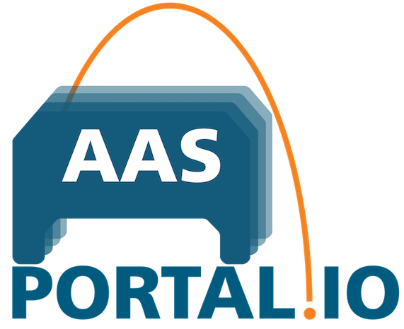

# AASPortal 

test!
**AASPortal** is a Node.js based web portal for the visualization and management of Asset Administration Shells (AAS). The implementation uses the concepts of the document "Details of the Asset Administration Shell" published on https://www.plattform-i40.de and licensed under Creative Commons CC BY 4.0. 

Check out the [Getting Started](./docs/source/gettingstarted.md) section to learn how to setup Visual Studio Code and start using and developing the *AASPortal*. Learn more about the [Architecture](./docs/source/architecture.md) of *AASPortal*, and check out the [Usage](./docs/source/usage.md) section to learn about available search filters for AAS and which Endpoints can be connected to the *AASPortal*.

For more details about the AASPortal see the full documentation :blue_book: [here](https://aasportal.readthedocs.io/en/latest/?badge=latest).

**AASPortal is under active development and we are looking forward to your active contributions!**
testitest
## Prerequisites
- Visual Studio Code meow
- Node.js v18.10.0 nya
- GIT 2.36.0.windows.1
- Docker Desktop 4.x kljsdfhdklf

## Getting Started
You can find a detailed documentation :blue_book: [here](https://aasportal.readthedocs.io/)

## Usage

### Setup Visual Studio Code
The preferred development environment is Visual Studio Code. Clone *AASPortal*'s GIT repository. Open aasportal in Visual Studio Code. In a terminal window execute the the following commands:

`npm install`

and

`npm run build -ws`

restart Visual Studio Code.

### Start AASPortal
The following command creates and executes a Docker image:

`npm run start`

Go to:

    http://localhost/

## Changelog

You can find the detailed changelog [here](docs/source/changelog/changelog.md).

## Contributors

| Name                | Github Account                                              |
| :------------------ | ----------------------------------------------------------- |
| Ralf Aron           | [ralfaron](https://github.com/ralfaron)                     |
| Alexander Wollbrink | [AlexanderWollbrink](https://github.com/AlexanderWollbrink) |
| Juilee Tikekar      | [juileetikekar](https://github.com/juileetikekar)           |
| Florian Pethig      | [fpethig](https://github.com/fpethig)                       |

## Contact

aasportal@iosb-ina.fraunhofer.de

## License

Distributed under the Apache 2.0 License. See `LICENSE` for more information.

Copyright (C) 2023, Fraunhofer IOSB-INA Lemgo, eine rechtlich nicht selbstaendige Einrichtung der Fraunhofer-Gesellschaft zur Foerderung der angewandten Forschung e.V., Germany

You should have received a copy of the Apache 2.0 License along with this program. If not, see https://www.apache.org/licenses/LICENSE-2.0.html.
