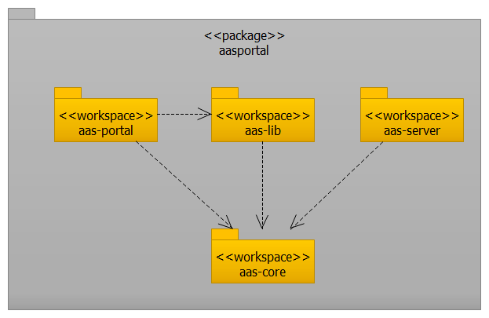

# Architecture and Design
## Main Package

## AASPortal
AASPortal is an Angular based WEB application. The UI is implemented with the Bootstrap 5 frontend toolkit in conjunction with Bootstrap widgets (ng-bootstrap). For managing the global and local state of the application the NgRx framework is used.

## AASServer
AASServer is a Node.js WEB application. The REST API provided by AASServer is realized with the WEB framework *Express*. For authentication the concept JSON Web Tokens is used. The implementation uses the module *jsonwebtoken*. The AASServer provides an OpenAPI-compliant REST API. To create the living documentation of the REST API the module *swagger-ui-express* is used.

For the access to Asset Administration Shells in an OPC UA server the *node-opcua* framework is used.

